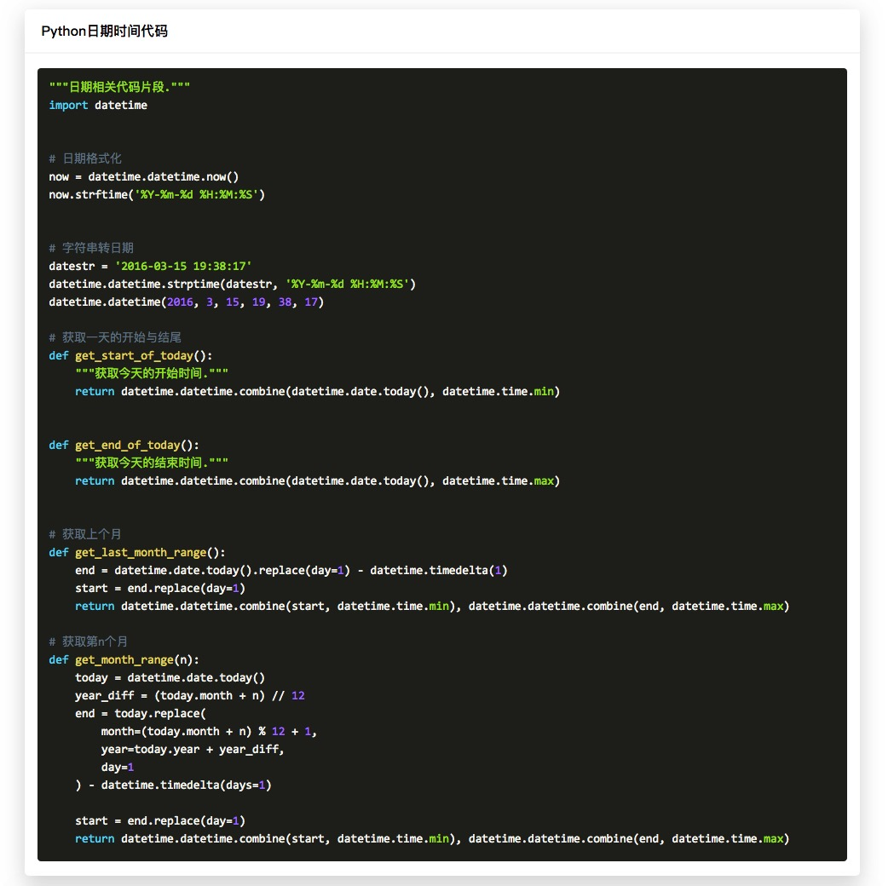

# CodeSnippet
code snippet

## website

https://codesnippet.top/



- captcha
- idcard
- qrcode


## idcard

```python
import re

IDCARD_REGEX = '[1-9][0-9]{14}([0-9]{2}[0-9X])?'


def is_valid_idcard(idcard):
    """Validate id card is valid."""
    if isinstance(idcard, int):
        idcard = str(idcard)

    if not re.match(IDCARD_REGEX, idcard):
        return False

    factors = [7, 9, 10, 5, 8, 4, 2, 1, 6, 3, 7, 9, 10, 5, 8, 4, 2]
    items = [int(item) for item in idcard[:-1]]

    copulas = sum([a * b for a, b in zip(factors, items)])

    ckcodes = ['1', '0', 'X', '9', '8', '7', '6', '5', '4', '3', '2']

    return ckcodes[copulas % 11].upper() == idcard[-1].upper()
```


## qrcode
```shell
pip install qrcode
pip install pillow
```

```python
import qrcode
img = qrcode.make('https://github.com/istommao/CodeSnippet')
img.show()
```

> [more about qrcode](https://github.com/lincolnloop/python-qrcode)
